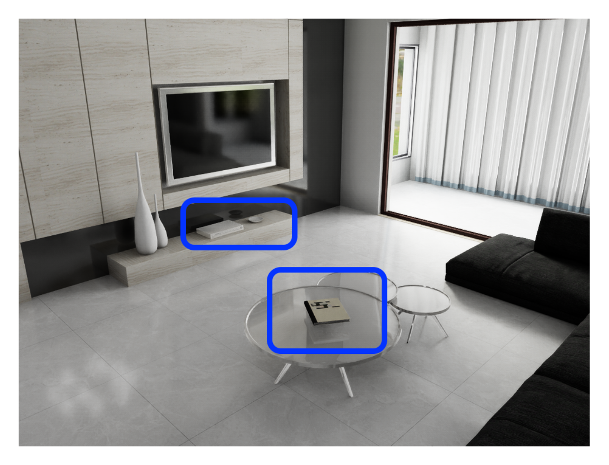
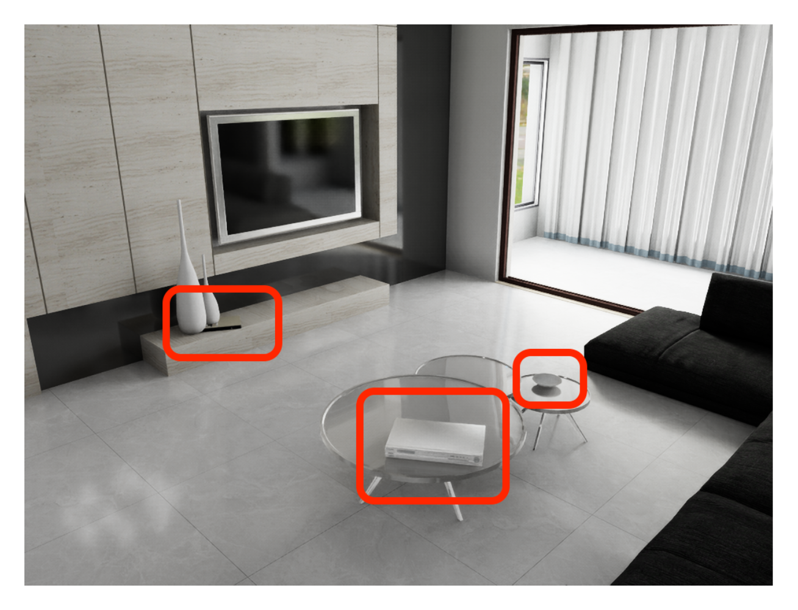

# SceneTrans

This is the official code repository for the SceneTrans project.

## Example

A representative A/B pair from the dataset (livingroom, `move` task):

| Frame A | Frame B |
| :---: | :---: |
|  |  |

Each pair is annotated with two complementary captions:

**GT (Description)** — describes the change as observed between the two frames:

> A small round plate was moved from the low media shelf beneath the TV to the small round nesting side table beside the sofa; it shifted to the right and downward in the view and remains upright, moved about 2.46 m. A rectangular TV box was moved from the low console shelf under the television to the top of the glass coffee table; it shifted right and down in the view and now lies flat on the coffee table, moved about 2.75 m. The book that was on the glass coffee table was relocated to the low console shelf next to the decorative vases on the left wall; it moved leftward and upward in the view and remains lying flat, moved about 2.32 m.

**GT (Action)** — describes the change as an instruction to transform A into B:

> Lift the plate from the media shelf beneath the TV and place it on the small round side table beside the sofa, moved about 2.46 m. Pick up the rectangular box from the console shelf under the TV and set it flat on the glass coffee table, moved about 2.75 m. Pick up the book from the glass coffee table and place it flat on the low console shelf next to the vases on the left wall, moved about 2.32 m.

## 1. Directory Structure

```text
SceneTrans/
├── assets/         # USD asset files used by simulation scenes
├── output/         # Generated data (pair folders); tracked with placeholder file
├── simulation/     # Isaac Sim scripts organized by room/task
│   ├── bedroom1-bed/
│   ├── bedroom1-shelf/
│   ├── childrenroom-desk/
│   ├── kitchen/
│   ├── livingroom/
│   ├── livingroom-shelf/
│   └── studyroom-desk/
└── annotation/     # Notebooks for post-processing and annotation generation
    ├── gen_add.ipynb
    ├── gen_move.ipynb
    └── gen_remove.ipynb
```

### 1.1 Assets (USD Files)

The `assets/` directory stores scene and object assets in USD format (for example, `.usd` and `.usda` files).  
Simulation scripts load these files as the source environment for rendering and for object-level operations such as add/remove/move.

### 1.2 Output and Placeholders

- `assets/.gitkeep` and `output/.gitkeep` are placeholders so these directories are preserved in Git even when empty.
- Generated samples are typically written under `output/<scene_name>/<setting>/pair_xxxx/`.

## 2. NVIDIA Isaac Sim Environment

This project is built on **NVIDIA Isaac Sim 5.1.0**, and we recommend running it via the official Docker image.

For installation, container launch, headless mode, and WebRTC streaming, please follow the [official Isaac Sim 5.1.0 container guide](https://docs.isaacsim.omniverse.nvidia.com/5.1.0/installation/install_container.html).

Once Isaac Sim is up and running, scripts in this project are launched from inside the container with:

```bash
./python.sh simulation/<scene-folder>/<script>.py [args...]
```

If you launch via CLI, make sure your script starts the simulation in headless mode before importing other modules:

```python
simulation_app = SimulationApp(launch_config={"headless": True})
```

## 3. Detailed Example: `simulation/livingroom`

This folder includes:

- `livingroom_add.py`
- `livingroom_remove.py`
- `livingroom_move.py`

All three scripts follow the same workflow (load USD -> randomize changes -> render paired outputs), but they differ in which objects are edited and how the A/B pair is constructed.

### 3.1 How to Run (Inside Container)

```bash
cd /workspace/SceneTrans
```

Run `remove`:

```bash
./python.sh simulation/livingroom/livingroom_remove.py \
  --pair-count 20 \
  --warmup-k 3 \
  --num-changes 2 \
  --width 1024 \
  --height 768 \
  --output-dir /workspace/output/livingroom_remove/demo_run
```

Run `add`:

```bash
./python.sh simulation/livingroom/livingroom_add.py \
  --pair-count 20 \
  --warmup-k 3 \
  --num-changes 2 \
  --origin \
  --output-dir /workspace/output/livingroom_add/demo_run
```

Run `move`:

```bash
./python.sh simulation/livingroom/livingroom_move.py \
  --pair-count 20 \
  --warmup-k 3 \
  --num-changes 2 \
  --origin \
  --output-dir /workspace/output/livingroom_move/demo_run
```

### 3.2 Parameters (Livingroom Scripts)

The three `livingroom_*.py` scripts support the following main arguments:

- `--pair-count`  
  Number of A/B pairs to generate.
- `--warmup-k`  
  Warmup multiplier before capture (`warmup_frames = 3 * k`).
- `--num-changes`  
  Number of objects changed per pair.
- `--origin`  
  Reset the scene to the initial layout before constructing each pair.  
  When enabled, Frame A of every pair is the same initial state (A frames are consistent across pairs).  
  When disabled, pairs are generated from the script's normal continuous/randomized flow.
- `--semantic-segmentation`  
  Enable semantic segmentation output when the script supports that writer setting.
- `--width`, `--height`  
  Output image resolution.
- `--focal-length`  
  Optional camera focal length override.
- `--output-dir`  
  Output root directory for generated `pair_xxxx` folders.

### 3.3 Default Output Paths (If `--output-dir` Is Not Provided)

- `livingroom_remove.py` -> `/workspace/output/livingroom_remove/3_items`
- `livingroom_add.py` -> `/workspace/output/livingroom_add/3_items`
- `livingroom_move.py` -> `/workspace/output/livingroom_move_origin/3_items`

## 4. Output Layout (Example)

Each run usually creates one folder per pair (`pair_xxxx`) under the selected output directory.  
A pair folder typically includes:

- `A_rgb.png` / `B_rgb.png`
- `A_depth.npy` / `B_depth.npy` (some scripts also export `A_depth.png` / `B_depth.png`)
- `A_instance_segmentation.png` / `B_instance_segmentation.png`
- `A_semantic_segmentation.png` / `B_semantic_segmentation.png` (if enabled)
- `metadata.json` (changed objects, coordinates, and other metadata)

## 5. Cross-Scene Notes

Different scene folders may have slight argument differences (for example, some scripts add `--run-count`, and some do not use `--origin`), but the overall pattern is very similar.  
For scripts that support `--origin`, the common behavior is: reset to initial state before each pair so all A frames stay aligned.

1. Choose a script under `simulation/<scene>/`.
2. Run it with `./python.sh ...`.
3. Tune `pair-count`, `num-changes`, resolution, and `output-dir`.
4. Validate generated `pair_xxxx` folders and `metadata.json`.
5. Use notebooks under `annotation/` for post-processing and annotation generation.

For exact details, always check each script's CLI arguments in its `argparse` section.

## 6. Building `unchanged` Data from Existing Results

You can construct `unchanged` pairs directly from already generated `add`, `move`, or `remove` data without rerunning simulation:

1. Pick any generated pair folder (for example `pair_0007`).
2. Select one side (`A` or `B`) as the base image.
3. Copy that same side to both outputs, for example:
   - `unchanged_A_rgb.png` <- `A_rgb.png`
   - `unchanged_B_rgb.png` <- `A_rgb.png`
4. Apply the same rule to other modalities if needed (`depth`, instance/semantic segmentation).

This creates a valid no-change sample because both sides in the pair come from the same rendered frame.  
In practice, different scenes may have small differences in file naming or optional outputs, but the construction logic is the same.

## 7. Annotation Workflow (`annotation/`)

The notebooks under `annotation/` are designed to run **after** pair generation is complete.

- `gen_add.ipynb`
- `gen_move.ipynb`
- `gen_remove.ipynb`

### 7.1 Input

Provide a path that contains generated pair folders (for example, a directory with `pair_0000`, `pair_0001`, ...).

### 7.2 What the Notebook Does

For the given input path, the notebook iterates through all pair folders and generates annotations for each pair.

### 7.3 Output

The annotation result for each pair is saved as a `result.json` file under the same pair folder.

### 7.4 Difference Between `add` / `move` / `remove`

The overall processing pipeline is similar across `gen_add.ipynb`, `gen_move.ipynb`, and `gen_remove.ipynb`.  
The main difference is the prompt/template logic used for each task type.
